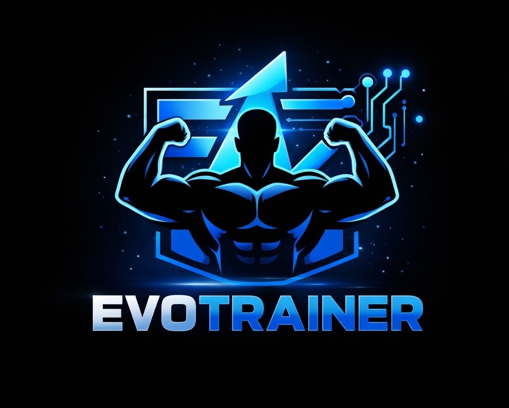

🏋️‍♂️ EvoTrainer - O teu Personal Trainer com IA

<b>A plataforma definitiva para Personal Trainers gerirem alunos, criarem treinos dinâmicos e utilizarem Inteligência Artificial para periodização automática.</b>

📖 Sobre o Projeto

O EvoTrainer é uma Progressive Web App (PWA) construída com foco na experiência mobile (Mobile-First). Foi desenhada para resolver o problema da criação manual e demorada de fichas de treino.

Com uma interface imersiva, o Personal Trainer pode gerir a sua carteira de alunos e, com a ajuda da IA (ChatGPT), desenhar estruturas completas de treino (A, AB, ABC, etc.) adaptadas a condições clínicas reais (ex: condromalácia, hipertensão). Além disso, o sistema pesquisa e anexa automaticamente vídeos do YouTube para a execução de cada exercício!

O aluno acede ao seu portal, visualiza a sua sequência ofensiva (🔥 streak), e entra num "Modo Foco" sem distrações para executar o treino do dia.

✨ Funcionalidades Principais

🧑‍🏫 Painel do Personal Trainer (Admin)

Gestão de Alunos: Dashboard intuitivo para adicionar, bloquear, remover e pesquisar alunos.

Construtor de Treinos: Criação de fichas detalhadas (Séries, Carga, Bi-sets/Conjugados).

Mágico de IA 🤖: Geração automática de periodização (A, AB, ABC, ABCD, ABCDE) baseada no perfil e restrições médicas do aluno. O sistema faz o loop automático pelos dias da semana.

Auto-YouTube Fetcher 📺: A app procura automaticamente o melhor vídeo de execução do exercício no YouTube e anexa à ficha do aluno.

💪 Painel do Aluno

PWA Instalável: Experiência de App nativa com prompt de instalação flutuante.

Modo Execução (Foco): Interface limpa para marcar os exercícios concluídos.

Player de Vídeo Embutido: Visualização da execução dos exercícios num modal modal interno (o aluno nunca sai da app). Possui Fallback inteligente caso a API do YouTube falhe.

Gamificação: Sistema de "Streak" (sequência de treinos) para manter o aluno motivado.

Perfil Fisiológico: Atualização de peso, altura, objetivos e WhatsApp.

🛠️ Tecnologias Utilizadas

Frontend: React.js, Next.js (App Router)

Estilização: Tailwind CSS (Fluid Design, responsivo)

Ícones: Lucide React

Integrações: * OpenAI API (Geração de Treinos)

YouTube Data API v3 (Busca de vídeos)

Backend/API: Node.js / Express (Configurável via variável de ambiente)

🚀 Como Executar o Projeto Localmente

Pré-requisitos

Certifique-se de que tem o Node.js e o npm instalados na sua máquina.

1. Clonar o repositório

git clone [https://github.com/SeuUsuario/Evotrainer.git](https://github.com/SeuUsuario/Evotrainer.git)
cd Evotrainer/frontend

2. Instalar as dependências

npm install

3. Configurar as Variáveis de Ambiente

Crie um ficheiro .env na raiz da pasta frontend e adicione as suas chaves privadas. Aviso: Nunca faça commit deste ficheiro!

# URL do seu Backend (use localhost para desenvolvimento ou o link de produção)
NEXT_PUBLIC_API_URL=http://localhost:3001

# Chave da OpenAI para o "Mágico de IA"
NEXT_PUBLIC_OPENAI_API_KEY=sk-proj-sua-chave-openai-aqui

# Chave do Google Cloud para pesquisa automática de vídeos
NEXT_PUBLIC_YOUTUBE_API_KEY=AIzaSy-sua-chave-youtube-aqui

4. Iniciar o servidor de desenvolvimento

npm run dev

A aplicação estará disponível em http://localhost:3000.

🛡️ Tratamento de Erros e Fallbacks (Resiliência)

O EvoTrainer foi desenhado para nunca deixar o utilizador "pendurado":

Limite da API do YouTube: Se a quota diária da API do YouTube for excedida (Erro 403), o sistema ativa o Plano B Supremo, embutindo uma pesquisa de iframe nativa para que o aluno continue a ver os vídeos dentro do Modal.

Variáveis Inexistentes: Se o ambiente de produção (ex: Vercel) perder o link do backend, o sistema faz fallback automático para o servidor principal (https://evotrainer.onrender.com).

📱 Capturas de Ecrã (Screenshots)

(Adiciona aqui algumas imagens do teu sistema. Podes arrastar as imagens para o GitHub e colar os links gerados aqui)

Painel Admin

Mágico de IA

Modo Foco (Aluno)

Player Embutido

🤝 Contribuição

Contribuições são sempre bem-vindas! Se quiseres melhorar o EvoTrainer:

Faz um Fork do projeto.

Cria uma Branch para a tua funcionalidade (git checkout -b feature/NovaFuncionalidade).

Faz o Commit das tuas alterações (git commit -m 'Adiciona NovaFuncionalidade').

Faz o Push para a branch (git push origin feature/NovaFuncionalidade).

Abre um Pull Request.

📄 Licença

Distribuído sob a licença MIT. Veja LICENSE para mais informações.

Desenvolvido com ☕ e 🏋️‍♂️ para revolucionar a consultoria fitness.
